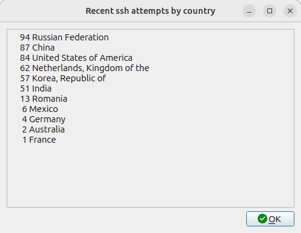

# ssh-report-by-country
Scripts to generate reports of ssh login attempts by country

This repository contains two scripts

The first script:

**sshattempts.sh** 

This has a dependency on being run in bash and bash loadable modules.

In Ubuntu to install:

```bash
apt install bash-builtins
```

It also expects that you have curl installed as it calls out to two sites for information.

It pulls a csv file from:

https://raw.githubusercontent.com/lukes/ISO-3166-Countries-with-Regional-Codes/refs/heads/master/all/all.csv

And it checks the nationality of ip4 addresses here:

https://ipinfo.io/

It assumes that your log file containing ssh logins is (and readable by the user):

`/var/log/auth.log`

The second script:

**sshattemptsdialog.sh**

Uses the first script to give you a graphical dialogue report

It has a dependency on the package kdialog.

`sudo apt install kdialog`

It assumes the location of the first script is the user's bin folder 

`/home/${USER}/bin/sshattempts.sh`

Both scripts need be marked as executable

`chmod a+x ~/bin/sshattempts.sh~` 

I leave it to you to write a desktop file to call this second script with a mouse click.



PS. If you do decide to have an sshd port open to the internet be sure that you limit the users who can log in and make sure the root user is not allowed. Disallow password logins and restrict login to keys only, and make those keys are protected by pass phrases, regularly replace your keys and delete old ones. Run fail2ban on your box and set your firewall to suppress spoofed ip addresses as far as possible. Also make sure that you keep all our software up to date!

There is a lot of information out there on how to protect yourself.

